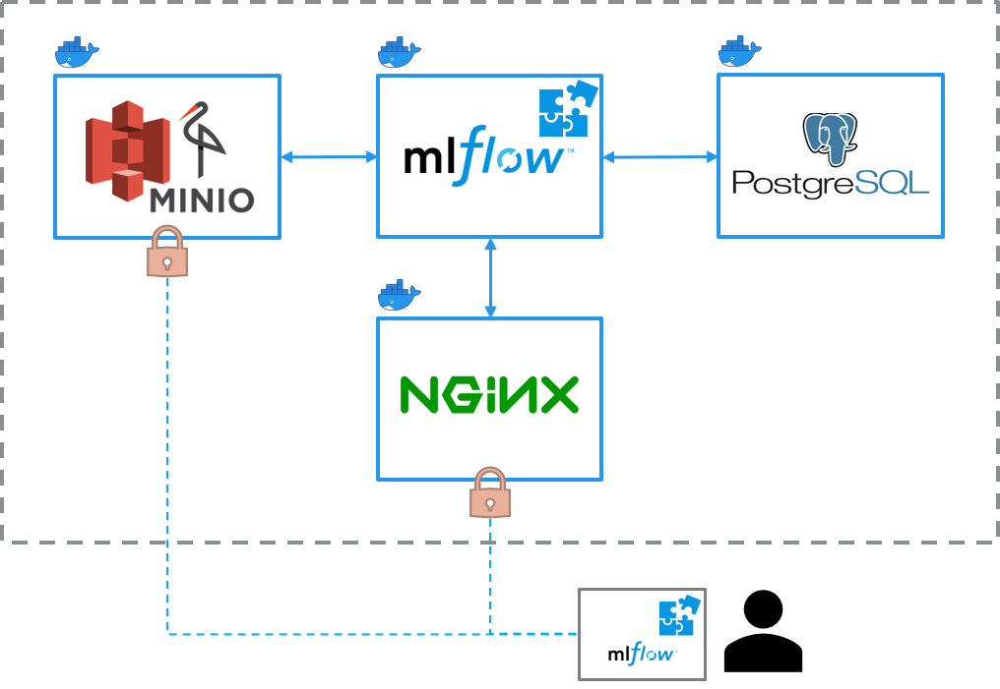

# mlflow-docker

This repository contains an MLflow docker setup.

## Docker Environment
### Architecture
1. PostgreSQL database
    - Stores runs and metrics
    - Not accessible
2. Minio s3 storage
    - Stores models and artifacts
    - Accessible via Port 19000
3. MLflow server
    - Orchestrates all tasks
    - Accessible via Port 15000 (via ngninx)
4. nginx webserver
    - Acts as authentication layer for the mlflow server



### Usage
Make sure the directory structure is as follows:
```
docker
├── docker-compose.yml
├── .env
├── minio
│   └── data
│       └── mlflow-bucket
├── mlflow_server
│   ├── Dockerfile
│   └── mlflow_plugin-1.0.1-py3-none-any.whl
├── nginx
│   ├── Dockerfile
│   ├── .htpasswd
│   ├── mlflow.conf
│   └── nginx.conf
└── postgres
    └── data
```

- Rename `.env-template` file to `.env`
- Populate `.env` file with the proper values
- Decide whether you want to include the plugin or not
- Start with `docker-compose -f "docker-compose.yml" up -d --build`
