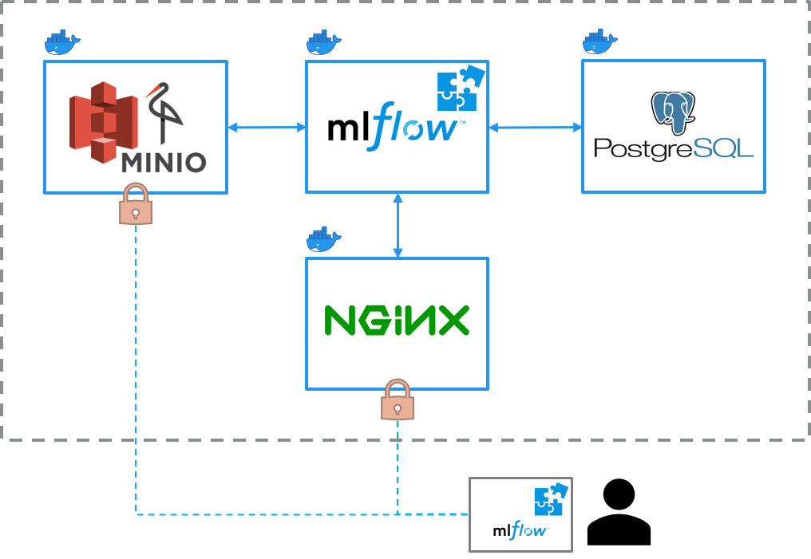

<h1 align="center">
	
</h1>

<h3 align="center">
	This repository contains a Docker-Setup for <a href="https://mlflow.org/" target="_blank">MLflow</a> with integrated authentication and MinIO + PostgreSQL storage
</h3>

<p align="center">
    
    
    
</p>

<p align="center">
  <a href="#addressed-issues">Addressed Issues</a> •
  <a href="#target-group">Target Group</a> •
  <a href="#architecture">Architecture</a> •
  <a href="#setup">Setup</a> •
  <a href="#todos">ToDos</a>
</p>

# Addressed Issues
This repro addresses the need for an easy solution to setup an MLflow-Docker-Environment.


# Target Group
This repo is for data scientists and engineers who want to use MLflow with a solid storage and authentication solution.


# Architecture

1. PostgreSQL database
    - Stores runs and metrics
    - Not accessible
2. Minio s3 storage
    - Stores models and artifacts
    - Accessible via Port 19000
3. MLflow server
    - Orchestrates all tasks
    - Accessible via Port 15000 (via ngninx)
4. nginx webserver
    - Acts as authentication layer for the mlflow server



# Setup
Make sure the directory structure is as follows (you can check out my mlflow_extension as well that fits perfectly to this setup):
```
docker
├── docker-compose.yml
├── .env
├── minio
│   └── data
│       └── mlflow-bucket
├── mlflow_server
│   ├── Dockerfile
│   └── mlflow_extension-xxx-py3-none-any.whl (optional)
├── nginx
│   ├── Dockerfile
│   ├── .htpasswd
│   ├── mlflow.conf
│   └── nginx.conf
└── postgres
    └── data
```

- Rename `.env-template` file to `.env`
- Populate `.env` file with the proper values
- Decide whether you want to include the plugin or not
- Start with `docker-compose -f "docker-compose.yml" up -d --build`


# ToDos
-  Nothing yet